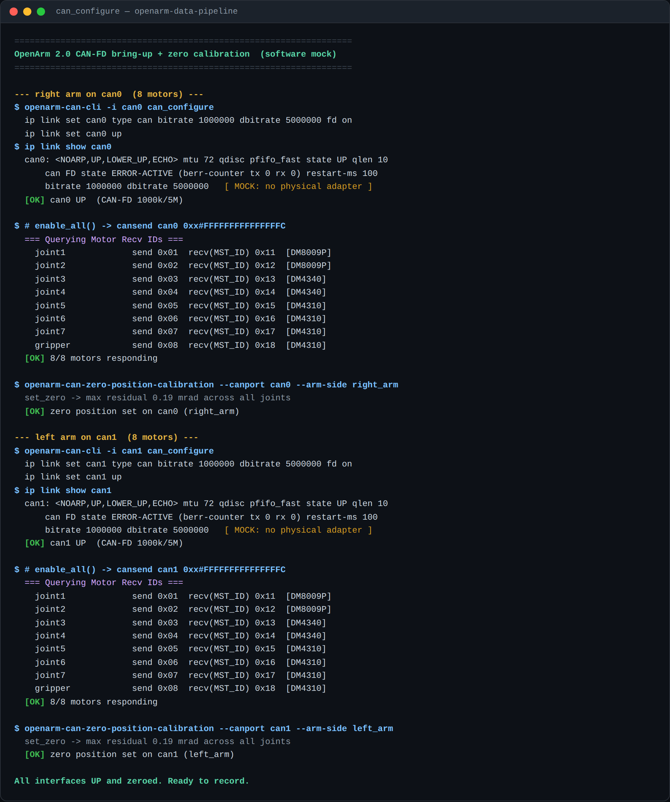
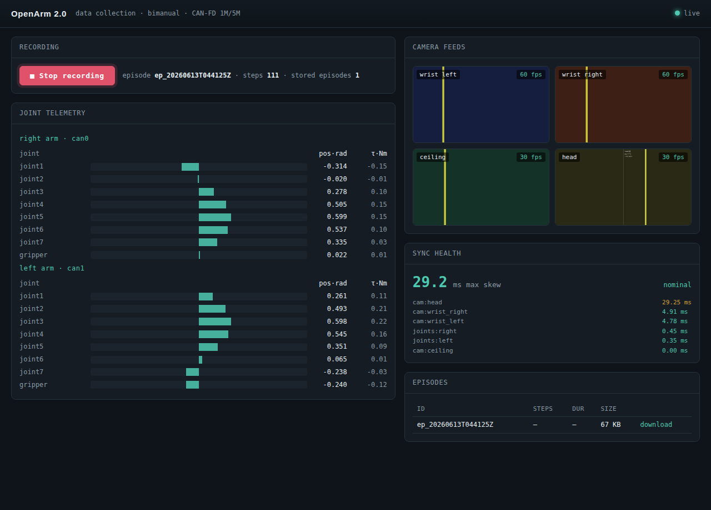

# OpenArm 2.0 — Data Collection Pipeline

*Take-home submission — Lufei Wang*

A data-collection platform for the OpenArm 2.0 bimanual arm: it reads joint telemetry over CAN-FD, captures synchronized frames from four cameras, stores each demonstration as a structured episode, exposes a REST API, and drives everything from a live web dashboard with start/stop recording.

> **Software-only build.** I did not have the physical hardware, so the CAN bus and cameras are mocked — but the mock is built to be faithful to the real system rather than a stand-in of convenience. Using the OpenArm documentation (`docs.openarm.dev` and the hardware/API reference), I matched the real CAN IDs, motor models and limits, CAN-FD bitrates, CLI commands, joint and camera names, and the Damiao motor frame format. As a result, the parsing, synchronization, storage, and serving code is the same code that would run against hardware; only the bytes' origin is simulated. Everywhere something is simulated, it is called out explicitly in the code and below.

All five tasks run end-to-end in software. The brief states that completing tasks 3–5 in software is as strong as 1–2 on hardware, so I implemented all of the data-pipeline, backend, and frontend work fully, and kept tasks 1–2 as faithful to the real protocol as possible without a CAN adapter.

---

## Tasks completed

| # | Task | Status | Notes |
|---|------|--------|-------|
| 1 | CAN interface setup | Done (mock) | `openarm-can-cli` configure + zero-position calibration; faithful terminal output |
| 2 | CAN data reading | Done (mock) | Live position / velocity / torque / temperature via the real Damiao feedback-frame codec |
| 3 | Multi-camera sync | Done (mock) | 4 cameras at native rates; frame-driven nearest-neighbour alignment to joint state |
| 4 | Storage + REST API | Done | MCAP episodes, plus export to OpenArm's native dataset format; list / metadata / download endpoints |
| 5 | Monitoring dashboard | Done | Live joint bars, camera feeds, sync health, episode list, Start/Stop |

**Task 1 — CAN setup.** The motors communicate over CAN-FD (1 Mbit/s nominal, 5 Mbit/s data). A CLI reproduces the real bring-up flow — `openarm-can-cli -i can0 can_configure`, then `openarm-can-zero-position-calibration` — printing the same observable results (interface UP, motors enabled, IDs queried, zero set) against the mock bus, since the real commands require a CAN adapter.

**Task 2 — CAN data reading.** Each joint's feedback is decoded through the real 8-byte Damiao MIT-mode frame layout (position as a 16-bit field, velocity and torque as 12-bit fields, MOSFET and rotor temperatures, an error/ID byte). The mock encodes its synthetic motion into that exact layout and the read path decodes it, so the quantization and parsing are genuinely exercised rather than bypassed.

**Task 3 — Multi-camera synchronization.** Four cameras run at their native rates (two wrist cameras at 60 fps, ceiling and stereo head at 30 fps). Each frame and joint sample is timestamped at acquisition; the recorder emits one synchronized bundle per frame of the slowest (anchor) camera, pairing every other sensor's nearest-in-time sample.

**Task 4 — Storage and API.** Episodes are recorded to MCAP (the robotics-standard, time-indexed, self-describing container) and can be exported to OpenArm's own dataset format. A small FastAPI service lists episodes, returns metadata, and downloads the raw file.

**Task 5 — Dashboard.** A single-page web dashboard shows live joint telemetry for both arms, the four camera feeds, per-sensor synchronization skew, the episode count, and a Start/Stop recording control.

### Task 1 evidence — interfaces UP and zero position set (`make can`)



### Live monitoring dashboard (`make serve`)



*Joint telemetry for both arms, four camera feeds, per-sensor sync skew, episode list, and recording control.*

---

## How to run

```bash
python -m venv .venv && source .venv/bin/activate
pip install -e .

make can       # Task 1: CAN-FD bring-up + zero position
make monitor   # Task 2: live joint telemetry
make demo      # Tasks 2–4: record an episode to MCAP and read it back
make export    # record, then export to OpenArm's native dataset format
make serve     # Tasks 4–5: dashboard + API at http://localhost:8000
make test      # codec + synchronizer tests   (run `pip install pytest` first)
```

Then open <http://localhost:8000> and click **Start recording**.

---

## Architecture

```
                 +------------------- Recorder (orchestrator) -------------------+
  CAN-FD         |                                                               |
  can0 --+       |   MockCANBus(right) --+                                        |
         +- Damiao|  MockCANBus(left)  --+-- joint loop (500 Hz) --+              |
  can1 --+ codec |                       |                         v              |
                 |   MockCamera x4 ------+-- frame buffers --> FrameSynchronizer  |
  4 cameras      |   (60/60/30/30 fps)   |     (per-sensor       nearest-neighbour|
  (threaded      |                       |      ring buffers)    anchored to the  |
   JPEG encode)  |                       |                       slowest camera)  |
                 |                       |                         | SyncedBundle |
                 |                       |                         v              |
                 |                       +---------------> EpisodeRecorder (MCAP) |
                 +-----------------------------------------------+----------------+
                                                                 |
                       FastAPI -- REST (list/meta/download) -----+
                               +- WebSocket (live state) ---------+
                               +- dashboard (HTML/JS) ------------+
                                                                 |
                                       openarm_export ---> OpenArm dataset (parquet + JPEGs)
```

The sensors sit behind interfaces (`CANBus`, `MockCamera`); the orchestrator owns the live system and recording lifecycle; the API and dashboard only read live state or toggle recording. Swapping mock for hardware is a one-line change in the bus factory.

```
src/openarm_pipeline/
  config.py             joints, motor limits, CAN IDs, camera config (edit here for hardware)
  can/damiao.py         Damiao feedback + command frame codec  <- real bit layout
  can/bus.py            CANBus interface, MockCANBus, SocketCANBus (hardware path)
  can/cli.py            Task 1: can_configure + zero-position mock
  cameras/camera.py     Task 3: mock cameras, threaded JPEG encode
  cameras/sync.py       Task 3: TimedBuffer + FrameSynchronizer
  storage/mcap_store.py Task 4: EpisodeRecorder + EpisodeStore (MCAP)
  storage/openarm_export.py  export a recorded episode to OpenArm's parquet dataset format
  recorder.py           orchestrator + live state
  api/server.py         Task 4/5: REST + WebSocket + dashboard
  api/static/dashboard.html
```

---

## Key design decisions and trade-offs

**CAN parsing is real, not faked.** I implemented the actual Damiao feedback-frame bit layout and verified a round-trip (encode → decode) in tests, including out-of-range clamping and the error/ID byte. The motor models, torque limits, and CAN IDs (J1–J7 → 0x01–0x07 / 0x11–0x17, gripper 0x08 / 0x18) match the hardware table, and the enable/disable/set-zero command words match the docs.

**Timestamping uses a monotonic clock at acquisition.** Every sample is stamped with a monotonic clock at capture, so a wall-clock/NTP step cannot corrupt the timeline; wall-clock time is recorded separately for human-readable indexing. On hardware these would be promoted to driver/kernel frame timestamps and the stereo camera's onboard clock.

**Synchronization is frame-driven and anchored to the slowest camera.** Rather than a free-running clock, each synchronized bundle is triggered by a new frame from the slowest (anchor) camera, and every other sensor contributes its nearest buffered sample. Measured skews: anchor 0 ms (by construction), joint state ~0.4 ms (effectively exact), 60 fps cameras ~3–6 ms, and the 30 fps stereo head ~28 ms with very low variance.

That last figure drove the most important decision. Two free-running cameras at the same rate (the 30 Hz anchor and the 30 Hz head) can sit up to one full frame period (~33 ms) apart purely from clock phase; nearest-neighbour matching cannot do better than that without a shared hardware trigger or PTP time synchronization. My first attempt used a 20 ms tolerance, which flagged essentially every bundle as degraded — a false alarm caused by an unphysically tight threshold. The correct threshold is one anchor frame period: below it is expected phase jitter, above it means a frame was genuinely dropped. With that fix, normal operation reports zero degraded bundles, and the degraded flag now means something real. Degraded bundles are kept and marked rather than silently paired with stale data or discarded. Images are never interpolated (meaningless for pixels); joint state is already sub-millisecond, so interpolating it is not worth the complexity.

**Real-time awareness: encoding runs off the event loop.** My first implementation encoded camera frames inline on the async event loop, and the heaviest stream (the stereo head) fell more than 100 ms behind. Moving the encode to worker threads — image libraries release the interpreter lock during the encode, so the loops genuinely run in parallel — brought every sensor back within its frame period. Capture timestamps are taken before the encode (mirroring a hardware frame-start timestamp), and the capture loop drops rather than queues if it falls behind, so latency cannot spiral. Camera resolution is set to ~480p to match what real teleoperation datasets (ALOHA, LeRobot) actually record.

**Storage: MCAP for recording, with export to OpenArm's native format.** An episode is several sensor streams at different rates sharing one timeline, which is exactly what MCAP is for: timestamped messages per channel, indexed by log time, schemas embedded in the file, append-friendly streaming writes, and a direct path into Foxglove and rosbag2. So MCAP is the live recording log. For data at rest, OpenArm has its own canonical format (a directory tree with `metadata.yaml` and `episodes/`, per-arm parquet tables for position/velocity/torque, and `cameras/<name>/<timestamp>.jpeg`), with a built-in LeRobot v2.1 export. Rather than ignore it, the pipeline records to MCAP and then exports to the OpenArm format, producing a tree that matches their documented layout exactly — directory structure, nanosecond filenames, joint names (`joint1…joint7`, `gripper`), camera stream names (`wrist_left`, `wrist_right`, `ceiling`, `head`), and metadata fields — so their validator and converter tools can pick it up. One honest caveat: the internal column convention of the per-arm parquet file is not specified in OpenArm's public docs, so the exporter uses an explicit, documented convention and recommends running their validator before production use.

**API design.** The API is thin and resource-oriented: list episodes, get one episode's metadata, download the raw file, start/stop recording, read live state, and preview a camera, plus a WebSocket for live updates. Downloads stream the raw recording; metadata is read back from the file's own summary so it cannot drift from the data; missing episodes return 404; and reads of an episode still being recorded return an "incomplete" status instead of erroring (a bug I found and fixed when the dashboard polled a half-written file).

---

## Faithfulness to the hardware, and what is mocked

**Matched to the docs exactly:** the CAN IDs for all eight joints per arm, the CAN-FD bitrates, the configure/zero/monitor commands, the motor models and torque ratings, seven joints plus a gripper, the four joint readings (position, velocity, torque, temperature), the enable/disable command words, the four camera roles, and the joint and camera names used by OpenArm's dataset format.

**Inferred where the docs did not specify** (noted in code): the exact per-joint motor assignment (described but not tabulated; affects only cosmetic torque scaling in the mock) and two of the lesser command codes (which follow the standard Damiao protocol).

**Mocked:** the CAN bus (synthetic motion round-tripped through the real codec; the real SocketCAN path is written but inert), the cameras (synthetic frames with on-frame metadata, encoded as real JPEGs at native rates), and the configure/zero CLI (prints the real commands and expected output rather than issuing them). Everything downstream of the sensor interfaces — synchronization, storage, export, REST, WebSocket, dashboard — is the real implementation.

---

## What I would do next

1. **Hardware bring-up.** Wire the SocketCAN path to a real adapter, validate the Damiao decode against `candump`, and confirm the CAN-ID table per arm.
2. **True time sync.** Add hardware-triggered capture or PTP across cameras to collapse the one-period phase skew between same-rate cameras, and promote software timestamps to kernel/driver and onboard-camera clocks.
3. **Full-rate observations.** Record the 500 Hz joint stream as its own channel so exported observations aren't downsampled to the 30 Hz bundle grid; split the stereo head into left/right on export; validate the parquet schema end-to-end.
4. **Depth and calibration.** Record the stereo camera's depth stream and calibrate camera extrinsics into the arm frame.
5. **Backpressure and integrity.** Bounded queues with explicit per-stream drop accounting, per-episode checksums, and a post-record validation pass.
6. **Hardening.** Authentication on the API, disk-space guards, graceful recovery if a sensor stalls mid-episode, and integration tests against recorded fixtures.

---

*Software-only build. AI tooling was used during development, as encouraged by the brief; all design decisions and trade-offs above reflect the choices made in building it.*
